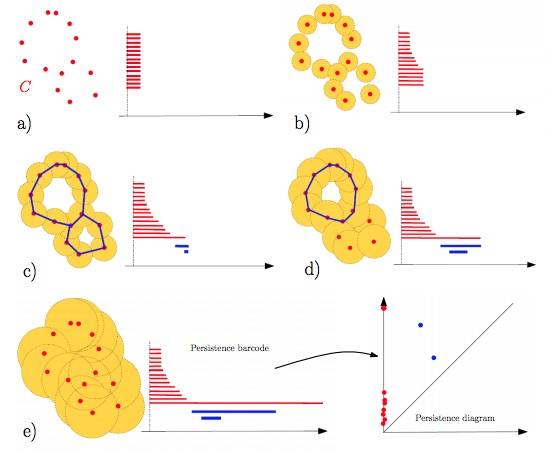
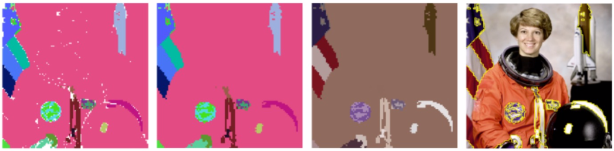

# Unsupervised image segmentation using persistent homology theory

## Topological Data Analysis 

In the early of 20s century Algebraic topology provided, thanks to Poincaré, a general framework to classify shapes. Indeed the **Euler characteristic** equal to the alternating sum of the Betti numbers is a **topological invariant**. Roughly these numbers count the number of distinct objects in the domain, the number of holes and the number of voids they contain etc...

  

**Topological Data Analysis** (TDA) is the field which apply these theorical tools in order to proceed data analysis. But these latter characteristics cannot be used straight forward because of the uncertainty of the datas and because of the sensitivity of Betti numbers to minor outliers in the data set. Therefore to tackle this issue the main tool TDA is using is **persistent homology**, in which the invariants are in the form of **persistence diagrams** also called **barcodes**. Topological invariants will then quantify the stability of geometric features with respect to degradation such as noise or artefacts

 

 
Credits @ Frédéric Chazal, Bertrand Michel

## Our Method 

We used TDA framework to perform unsupervised image segmentation. The set of images provided by the skimage library from python and the python library Gudhi @INRIA to produce simplicial complexes and persistence diagrams. 

The main **procedure** was as followed : 

+ Apply a small **gaussian blur** to the image to remove isolated pixels (outliers)
+ Take a random sample of points from the image called **superpixels**. We obtain a 3D cloud point if image is gray a 5D cloud point if the image is in color. 
+ Compute the **Nested Rips-Vietoris complexes** from those points 
  + Computed nested RV complexes for radius ε from 0 to infinity 
  + Set a value for edges : the distance between the two vertices. Value of vertices is set to 0. 
  + Set a value for each simplex by taking the max value of all its edges (Method called age filter) 
+ Compute the **persistent pairs** for homology groups for dimensions 0 and 1 and for 1 and 2. 
  + For dimensions 0 and 1 these are pairs (c,e) where e is an edge that vanish a connected component c (represented by its first vertex).
  + For dimensions 1 and 2 these are pairs (c,e) where e is an edge that vanish a 1-loop c (represented by its first vertex).
+ We compute the graph from the set of all edges of persistent pairs of dimensions 0-1. In fact it is equivalent as computing the **covering tree** of the 1-skeleton of our RV-complex, that is to say the covering tree over our cloud data point with minimum value.
+ In order to compute most persistent connected components and loops we then apply different procedures:
  + For connected components we compute the **graph** from the set of all edges of persistent pairs of dimensions 0-1. In fact it is equivalent as computing the **covering tree** of the 1-skeleton of our RV-complex, that is to say the covering tree over our cloud data point with minimum value.Then **removing** n − 1 edges from this tree in decreasing order of value gives us the n most persistent connected components.
  + For cycles we **add** edges which give birth to the most persistent cycles through the filtration. Then we find loops with a **traversal algorithm**
+ The most persistent connected components and the most persistent cycles give each a segmentation of our images.

*Please note that in practice to compute most relevant and persistent 0 homology groups we followed two more steps we don't develop:*
+ to compute most relevant connected components we actually use a **tree** where each split represents a persistence pair and we use **gini criterion** to select most relevant ones 
+ we use a **sampling method** based on empirical distribution of superpixel labels to infer labels on every pixels from image 

## Our Results

**Note:** since computation was heavy for our computer we had to use only 5000 to 10000 superpixels that is 2% to 4% of all pixels. It is interesting to see that we still managed to get decent results while TDA researchers actually use all pixels into their computation.

