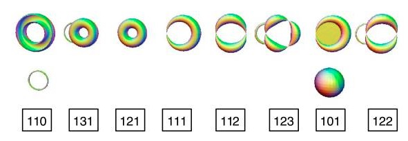

# Unsupervised image segmentation using persistent homology theory

In the early of 20s century Algreabic topology provided, thanks to Poincaré, a general framework to classify shapes. Indeed the **Euler characteristic** equal to the alternating sum of the Betti numbers is a **topological invariant**. Roughly these numbers count the number of distinct objects in the domain, the number of holes and the number of voids they contain etc...

**Topological Data Analysis** (TDA) is the field which apply these theorical tools in order to proceed data analysis. But these latter characteristics cannot be used straight forward because of the uncertainty of the datas and because of the sensitivity of Betti numbers to minor outliers in the data set. Therefore to tackle this issue the main tool TDA is using is **persistent homology**, in which the invariants are in the form of **persistence diagrams** also called **barcodes**. Topological invariants will then quantify the stability of geometric features with respect to degradation such as noise or artefacts

